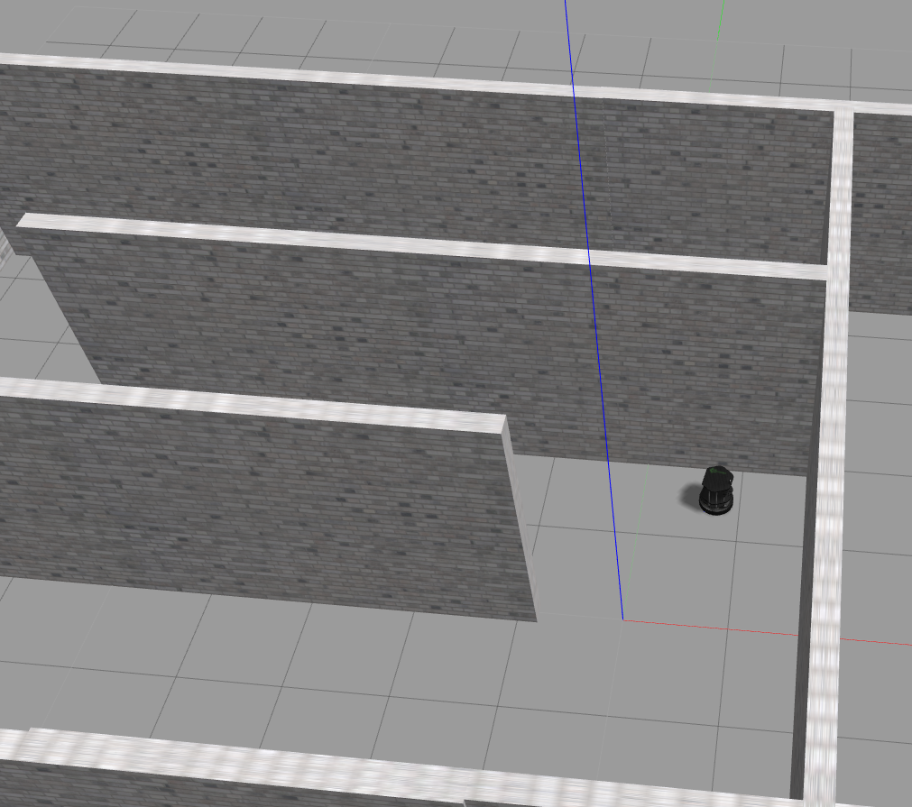
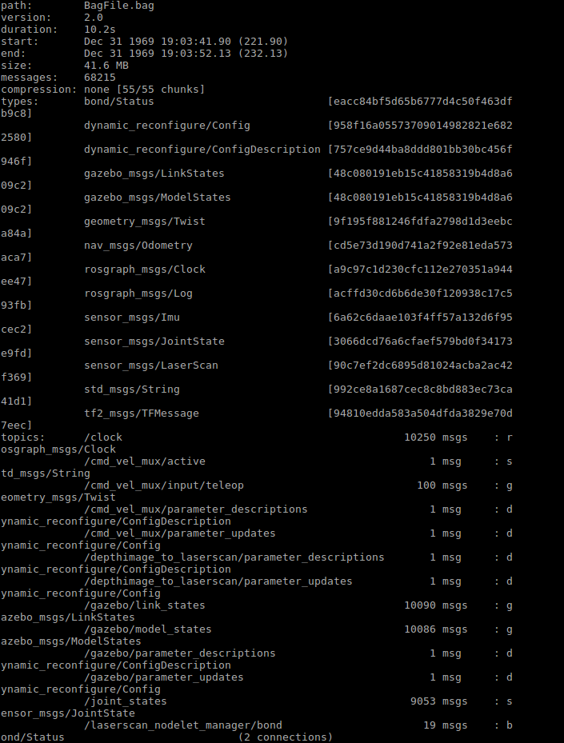
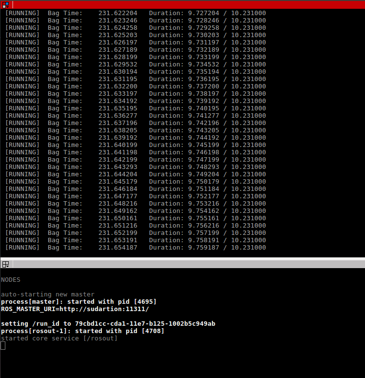

# TurtleBot Roomba Walker

## Overview

This repository executes a simple walking algorithm for the TurtleBot on Gazebo. The walking algorithm makes the TurtleBot work similar to the Roomba robot wherein it travels in a straight line until confronted by an obstacle. When it detects an obstacle using the data from the Laser sensor , it rotates about its place till there is no obstacle detected and continues to move straight.

## To Build

* Creating a catkin workspace:

```
mkdir catkin_ws
cd catkin_ws
mkdir src
catkin_make
```
* Cloning the repository and build:
```
cd catkin_ws
cd src
git clone https://github.com/sudrag/TurtleBot-Walker.git
cd ..
catkin_make
```

## To run

* To run this project, one must type the following commands in a terminal:
```
cd ~/catkin_ws
source devel/setup.bash
roslaunch turtlebot_walker tbw.launch
```
This launch file will start Gazebo with the TurtleBot in the corridor environment. The TurtleBot moves around the map executing the required Walker algorithm. The Gazebo output can be seen below:



The terminal output would resemble :

>[ INFO] [1511144659.806017002, 304.965000000]: Dist: 0.721209, Drive  
>[ INFO] [1511144659.916769707, 305.065000000]: Dist: 0.706227, Drive  
>[ INFO] [1511144660.030342646, 305.165000000]: Dist: 0.691241, Turn  
>[ INFO] [1511144660.149603823, 305.266000000]: Dist: 0.676261, Turn  
> ...

## Generating Bag File

* The bag file is made to record all the topics published by the talker and can be run using the same launch file. 

```
cd ~/catkin_ws
source devel/setup.bash
roslaunch turtlebot_walker tbw.launch StartRec:=true
```
This creates a bag file called *BagFile.bag* in the *.ros* folder. To view the file:

```
cd ~/.ros
rosbag info BagFile.bag
```
This displays the information about the bag file and looks like:



The repository already contains a bag file which was run for approximately 30 seconds.
* To run the nodes without the recording just mention *StartRec:=false* or not providing that argument at all when calling the launch file

## Bag File playback

The bag file generated can be used as data for playback . To run the bag file generated:
* In Terminal 1 run:
```
roscore
```
* In Terminal 2 run:
```
cd ~/.ros
rosbag play BagFile.bag
```
This will replay the rosbag as shown below:



* The above procedure is to run the rosbag generated from the previous section. To use the rosbag in the Results folder, the following commands needs to be run (Assuming roscore is still running) :
```
cd ~/catkin_ws/src/TurtleBot-Walker/Results
rosbag decompress -f Bagfile.bag
rosbag play Bagfile.bag
```

This is due to the fact that the uploaded *Bagfile.bag* was bigger than the 100mb file limit allowed by Github and hence needed to be compressed.

## Dependencies

* ROS Kinetic
* Catkin
* roscpp package
* std_msgs package
* message_generation package
